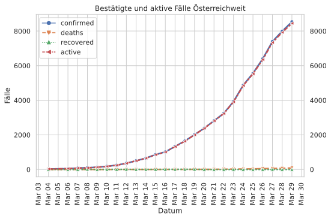
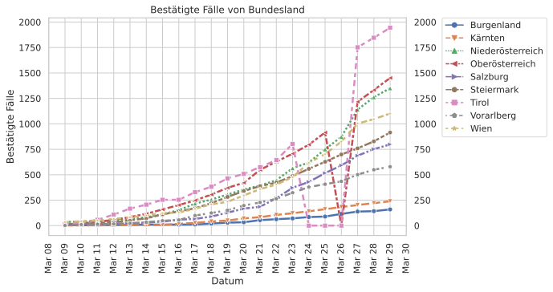
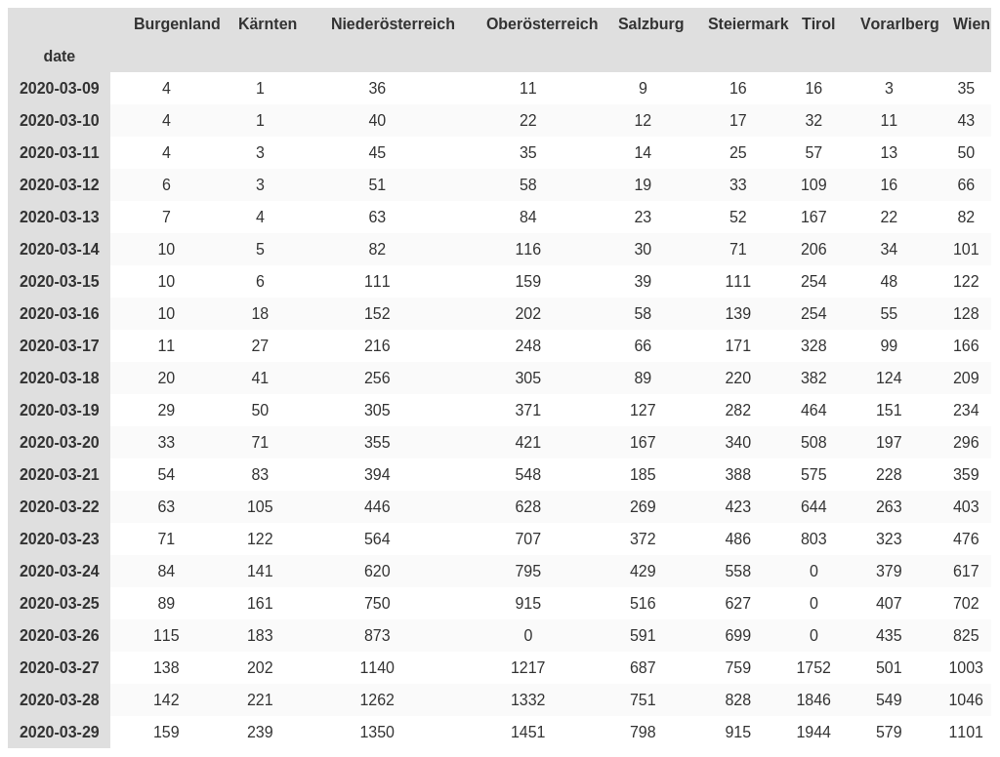
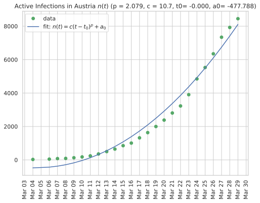
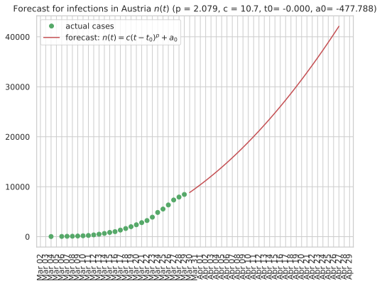

# 🇦🇹 Österreich Austria - COVID-19 Cases

[](https://github.com/Ramblurr/Austria-COVID-19/actions?query=workflow%3A%22Automatic+update%22)

Data concerning confirmed cases and recoveries of the novel coronavirus that causes COVID-19.

**Sources**:
  * The Bundesministerium für Soziales, Gesundheit, Pflege und Konsumentenschutz's [update page](https://www.sozialministerium.at/Informationen-zum-Coronavirus/Neuartiges-Coronavirus-(2019-nCov).html)
  * Historical data (before 2020-03-11) was filled in from archive.org's [historical snapshots of the above page](https://web.archive.org/web/*/https://www.sozialministerium.at/Informationen-zum-Coronavirus/Neuartiges-Coronavirus-(2019-nCov).html).


## Current Data

**Last updated at:** 

#### Data in CSV Format:

* [cases.csv](./data/cases.csv)
* [recovered.csv](./data/recovered.csv)

### Total Confirmed Cases


### Total Active Cases

- "active" cases are those which have not recovered or not died


### Total Confirmed Recoveries


### Total Deaths


### Total Tests


### Bestätigte und aktive Fälle Österreichweit

- "active" cases are those which have not recovered or not died



### Confirmed cases by Bundesland





### Forecast of increase in infections

- **Assumes no significant change to mitigation measures**
  - Given [the announcement on 2020-03-13 by the Austrian Government](https://www.derstandard.at/jetzt/livebericht/2000115687827/neue-massnahmen-sollen-ausbreitung-des-coronavirus-eindaemmen?responsive=false), this is not a valid assumption.
- Credit to [Hans Fangohr](https://github.com/fangohr/coronavirus-2020) for the methodology

[table1]: start
<pre>
Forecast for cases in Austria:

Last data point used in forecast from 2020-03-13 00:00:00

Infections in 10 days:    584 (14 Mar 2020)
Infections in 11 days:    715 (15 Mar 2020)
Infections in 12 days:    861 (16 Mar 2020)
Infections in 13 days:   1021 (17 Mar 2020)
Infections in 14 days:   1198 (18 Mar 2020)
Infections in 15 days:   1389 (19 Mar 2020)
Infections in 16 days:   1597 (20 Mar 2020)
Infections in 17 days:   1821 (21 Mar 2020)
Infections in 18 days:   2060 (22 Mar 2020)
Infections in 19 days:   2317 (23 Mar 2020)
Infections in 20 days:   2589 (24 Mar 2020)
Infections in 21 days:   2878 (25 Mar 2020)
Infections in 22 days:   3185 (26 Mar 2020)
Infections in 23 days:   3508 (27 Mar 2020)
Infections in 24 days:   3848 (28 Mar 2020)
Infections in 25 days:   4205 (29 Mar 2020)
Infections in 26 days:   4580 (30 Mar 2020)
Infections in 27 days:   4973 (31 Mar 2020)
Infections in 28 days:   5383 (01 Apr 2020)
Infections in 29 days:   5811 (02 Apr 2020)
Infections in 30 days:   6256 (03 Apr 2020)
Infections in 31 days:   6720 (04 Apr 2020)
Infections in 32 days:   7202 (05 Apr 2020)
Infections in 33 days:   7702 (06 Apr 2020)
Infections in 34 days:   8220 (07 Apr 2020)
Infections in 35 days:   8756 (08 Apr 2020)
Infections in 36 days:   9312 (09 Apr 2020)
Infections in 37 days:   9885 (10 Apr 2020)
Infections in 38 days:  10478 (11 Apr 2020)

Fit parameters: p = 2.187 c = 3.67 t0= -0.000 a0= 19.949
</pre>
[table1]: end


#### Fitting the curve


#### Forecasts for cases in Austria



### How long does it take for the number of infections to double?

- ORF reported on 2020-03-12 that doubling was at 2.5 days
- however the the recent [Lancet paper](https://www.thelancet.com/journals/lancet/article/PIIS0140-6736(20)30260-9/fulltext) reports 6.4 days after studiying data from China for Dec 31, 2019, to Jan 28, 2020,
- based on %20%3D%20%202n(t)), we find 
- the time for infections or deaths to double is thus given by 
- **Assumes no significant change to mitigation measures**
- Credit to [Hans Fangohr](https://github.com/fangohr/coronavirus-2020) for the methodology

**Notably** these findings reproduce the ORFs reporting that in Austria around 2020-03-12 doubling was happening every 2.5 days.

[table2]: start
<pre>
Forecast for infections doubling in austria:

at day  0 (04 Mar 2020), the time to double n is  2.2 days
at day  2 (06 Mar 2020), the time to double n is  1.4 days
at day  4 (08 Mar 2020), the time to double n is  1.8 days
at day  6 (10 Mar 2020), the time to double n is  2.4 days
at day  8 (12 Mar 2020), the time to double n is  3.1 days
at day 10 (14 Mar 2020), the time to double n is  3.8 days
at day 12 (16 Mar 2020), the time to double n is  4.6 days
at day 14 (18 Mar 2020), the time to double n is  5.3 days
at day 16 (20 Mar 2020), the time to double n is  6.0 days
at day 18 (22 Mar 2020), the time to double n is  6.8 days
at day 20 (24 Mar 2020), the time to double n is  7.5 days
at day 22 (26 Mar 2020), the time to double n is  8.2 days
at day 24 (28 Mar 2020), the time to double n is  9.0 days
at day 26 (30 Mar 2020), the time to double n is  9.7 days
at day 28 (01 Apr 2020), the time to double n is 10.5 days

</pre>
[table2]: end

## Developer

#### Setup your virtualenv

```console
virtualenv -p $(which python3) venv
source venv/bin/activate
```

#### Update the csvs

```console
pip install -r requirements.txt
python -m parsers.austria
```

#### Update the plots

```console
jupyter nbconvert --execute --inplace *.ipynb
```

## License
Licensed under BSD 3-Clause License

```
Copyright (c) 2020, Hans Fangohr
Copyright (c) 2020, Casey Link
```

Github workflow Copyright (c) 2020 [Alex](https://github.com/alext234). Licensed under Apache 2.0.

**Inspired by:**

* https://github.com/alext234/coronavirus-stats
* https://github.com/fangohr/coronavirus-2020

